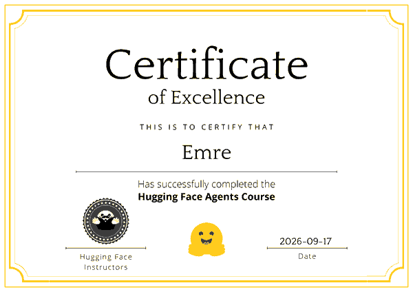

# Hugging Face AI Agents Course

Work from the [Hugging Face AI Agents Course](https://huggingface.co/learn/agents-course), completed with a **Certificate of Excellence** (September 2026).

<p align="center">
  
</p>

## Results

| Milestone | Result | Certificate |
|---|---|---|
| Unit 1 — Fundamentals of Agents (quiz) | **100%** | [Certificate of Achievement](certificate/unit1_fundamentals_certificate.png) |
| Unit 4 — Final assignment (GAIA-style benchmark, 20 questions) | **35%** (7 / 20), pass threshold 30% | [Certificate of Excellence](certificate/certificate_of_excellence.png) |

## Final project: Atlas Research Agent

[`atlas-research-agent/`](atlas-research-agent) is a tool-calling research agent built from scratch for the Unit 4 final assignment. It answers GAIA-style questions by searching the web, reading pages, PDFs and attachments, and returning a single concise answer. It has no answer lookup table: the official score came from running the agent on the real questions.

- **Agent loop:** provider-independent, OpenAI-style function calling with context compaction, duplicate-call detection and an answer-finalization pass.
- **Tools:** web search, URL/PDF reader, attachment reader, a safe AST-based calculator, and text reversal.
- **Safety:** SSRF guard on every URL (including redirects), no `eval`/`exec`/shell, size limits on downloads and context.
- **Runs locally:** the recorded result used `qwen3.5-9b` (Q4_K_M) served by LM Studio on a single 8 GB laptop GPU, with no cloud credits.

The project README covers the design decisions, per-question results, how to run it, and its measured limitations.

## Structure

```
huggingface-agents-course/
├── README.md
├── atlas-research-agent/   # Unit 4 final project (code, tests, evaluation summary)
└── certificate/            # Unit 1 and final certificates
```
