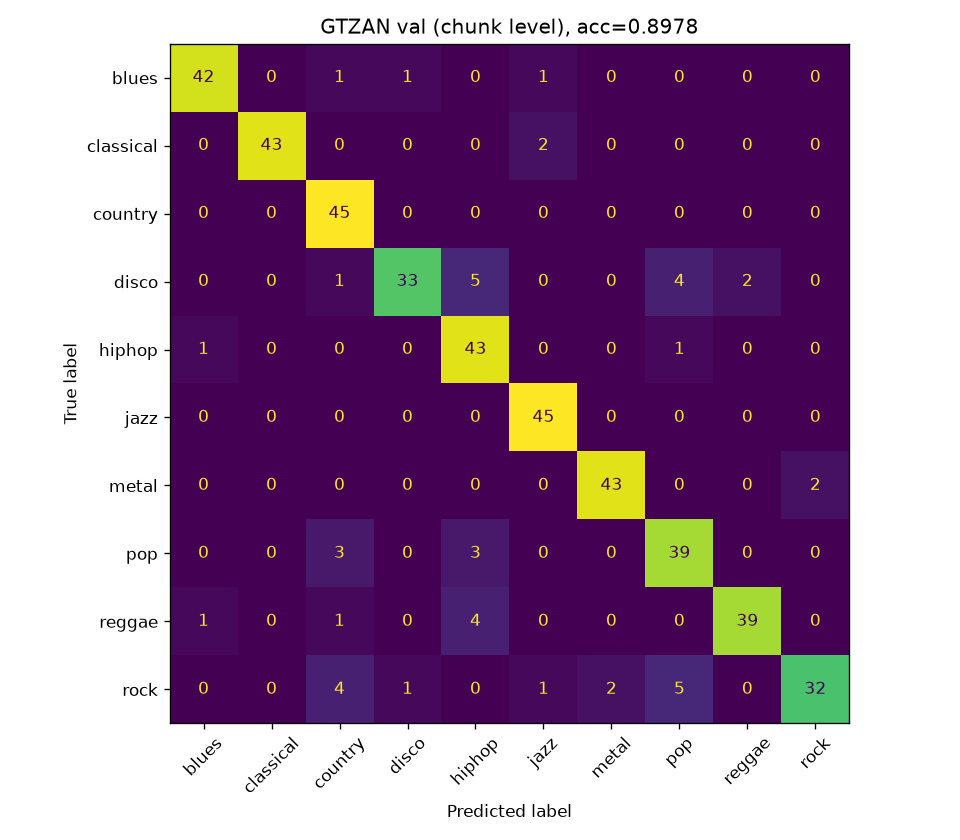

# Hugging Face Audio Course — Hands-on Assignments

[](https://www.python.org/)
[](https://pytorch.org/)
[-76B900.svg?style=flat&logo=nvidia)](https://developer.nvidia.com/cuda-zone)
[](https://huggingface.co/docs/transformers)
[](https://gradio.app/)
[](LICENSE)

All four hands-on assignments of the [Hugging Face Audio Course](https://huggingface.co/learn/audio-course)
(Units 4–7), trained locally on a single 8 GB laptop GPU (RTX 5060, Blackwell / sm_120) and published to the Hugging Face Hub.

## Results

| Unit | Task | Model on the Hub | Base model / data | Result | Pass criterion |
|---|---|---|---|---|---|
| 4 | Music genre classification | [ast-finetuned-audioset-10-10-0.4593-finetuned-gtzan](https://huggingface.co/Zorlu5454/ast-finetuned-audioset-10-10-0.4593-finetuned-gtzan) | AST (AudioSet) / GTZAN | **accuracy 0.8978** (chunk), 0.9133 (clip) | accuracy ≥ 0.87 |
| 5 | Speech recognition | [whisper-tiny-minds14-en-us](https://huggingface.co/Zorlu5454/whisper-tiny-minds14-en-us) | whisper-tiny / MINDS-14 en-US | **normalized WER 0.2940** (zero-shot 0.4014) | WER < 0.37 |
| 6 | Text-to-speech (Dutch) | [speecht5_finetuned_voxpopuli_nl](https://huggingface.co/Zorlu5454/speecht5_finetuned_voxpopuli_nl) | SpeechT5 / VoxPopuli nl | eval loss **0.4596** | valid `text-to-speech` model |
| 7 | Speech-to-speech translation → Turkish | Space (code in [`unit7_speech_translation/space`](unit7_speech_translation/space); publishing pending, Gradio Spaces need HF PRO) | Whisper-base → opus-mt-tc-big-en-tr → MMS-TTS-tur | output language ID **`tur` (0.99997)** | public demo, non-English output |

All metrics come from the JSON files in [`results/`](results/).

### Unit 4 — GTZAN confusion matrix (validation, chunk level)



| Run | lr | Epochs | Label smoothing | Chunk acc. | Clip acc. |
|---|---|---|---|---|---|
| `lr3e-5_ep8` (published) | 3e-5 | 8 | 0 | **0.8978** | **0.9133** |
| `lr5e-5_ep10_ls0.1` | 5e-5 | 10 | 0.1 | 0.8889 | 0.9067 |

### Unit 5 — WER during training (113 eval utterances)

| Step | 0 (zero-shot) | 100 | 200 | 300 | **400** | 500 |
|---|---|---|---|---|---|---|
| Normalized WER | 0.4014 | 0.3022 | 0.3099 | 0.3158 | **0.2946** | 0.2963 |

### Unit 6 — evaluation loss (826 utterances)

| Step | 1000 | 2000 | 3000 | **4000** |
|---|---|---|---|---|
| Eval loss | 0.4795 | 0.4656 | 0.4611 | **0.4596** |

## What is done carefully

- **No leakage in Unit 4:** GTZAN clips are split by clip (stratified, 85/15) *before* cutting them into 10 s chunks; asserted in code.
- **Course-checker compatible model cards:** `datasets`, `tasks` and metric lines exactly as the
  [progress checker](https://huggingface.co/spaces/MariaK/Check-my-progress-Audio-Course) parses them (WER as a decimal).
- **transformers 5.x pitfalls handled:** `load_best_model_at_end` silently fails to reload AST weights (no key conversion),
  so the best checkpoint is reloaded with `from_pretrained` and evaluated once more; `warmup_ratio` → float `warmup_steps`;
  the `translation` pipeline no longer exists (Marian is called directly).
- **No torchcodec / ffmpeg dependency:** `datasets` 5.x audio is read as raw bytes (`decode=False`) and decoded with soundfile.
- **Unit 7 tested like the grader:** [`check_space.py`](unit7_speech_translation/src/check_space.py) calls `/predict` with the
  grader's `test_short.wav` and runs `facebook/mms-lid-126` on the output, in a venv that mirrors the Space (gradio 5.49.1, CPU).

## Repository structure

```
huggingface-audio-course/
├── hub_card.py                     # shared: restore a finished Trainer run, fill the model card, upload
├── unit4_genre_classifier/src/     # data.py (GTZAN, clip split, AST features), train.py, publish.py
├── unit5_whisper_finetune/src/     # train.py (collator, WER), publish.py
├── unit6_speecht5_tts/src/         # prepare.py (speakers, x-vectors), train.py, publish.py
├── unit7_speech_translation/
│   ├── space/                      # the Hugging Face Space (app.py, requirements.txt, README.md)
│   └── src/check_space.py          # local copy of the Unit 7 grader
├── results/                        # metrics (JSON) and figures
├── docs/                           # code + math notes per unit (Turkish)
├── requirements.txt
└── LICENSE
```

## Setup

```powershell
py -3.11 -m venv .venv
.\.venv\Scripts\Activate.ps1
pip install -r requirements.txt          # torch 2.11.0+cu128 (needed for RTX 50xx / sm_120)
python -c "import torch; print(torch.cuda.is_available(), 'sm_120' in torch.cuda.get_arch_list())"
pip install speechbrain                  # Unit 6 speaker embeddings only
```

## Reproduce

```powershell
# Unit 4 (~20 min)
python unit4_genre_classifier/src/train.py --run-name lr3e-5_ep8 --lr 3e-5 --epochs 8
# Unit 5 (~10 min)
python unit5_whisper_finetune/src/train.py --run-name lr1e-5_s500 --lr 1e-5 --max-steps 500
# Unit 6 (~9 GB download, ~10 min preprocessing, ~85 min training)
python unit6_speecht5_tts/src/prepare.py
python unit6_speecht5_tts/src/train.py --run-name nl_s4000 --max-steps 4000
# Unit 7: run the Space locally (CPU) and check it like the grader does
cd unit7_speech_translation/space; python app.py
python unit7_speech_translation/src/check_space.py --space http://127.0.0.1:7860/ --audio test_short.wav
# Publish (after `hf auth login`): every publish.py has a --dry-run that prints the model card and file list
python unit4_genre_classifier/src/publish.py --run-name lr3e-5_ep8 --dry-run
```

Windows notes: `dataloader_num_workers=0` everywhere; fp16 + gradient accumulation (and gradient checkpointing for SpeechT5) to fit 8 GB.

## Documentation

Per-unit notes (in Turkish) explaining the code and the math — cross-entropy and AST patching, WER/Levenshtein,
SpeechT5 L1 + stop-token BCE, x-vectors, HiFi-GAN/VITS GAN losses — and how they relate to my earlier
[AST animal-sound classifier](https://github.com/emrezorlu1239/ast-animal-sound-classifier) and [conditional-GAN](https://github.com/emrezorlu1239/conditional-gan-animal-faces) projects:
[unit 4](docs/unit4.md) · [unit 5](docs/unit5.md) · [unit 6](docs/unit6.md) · [unit 7](docs/unit7.md) · [summary](docs/summary.md)

## References

- Gong, Chung, Glass — *AST: Audio Spectrogram Transformer*, Interspeech 2021.
- Radford et al. — *Robust Speech Recognition via Large-Scale Weak Supervision* (Whisper), 2022.
- Ao et al. — *SpeechT5: Unified-Modal Encoder-Decoder Pre-Training for Spoken Language Processing*, ACL 2022.
- Kong, Kim, Bae — *HiFi-GAN*, NeurIPS 2020. Kim, Kong, Son — *VITS*, ICML 2021. Pratap et al. — *Scaling Speech Technology to 1,000+ Languages* (MMS), 2023.
- Tzanetakis & Cook — GTZAN, 2002. Gerz et al. — MINDS-14, 2021. Wang et al. — VoxPopuli, ACL 2021.

## License

Code: [MIT](LICENSE). Models inherit the licenses of their base models and datasets.
