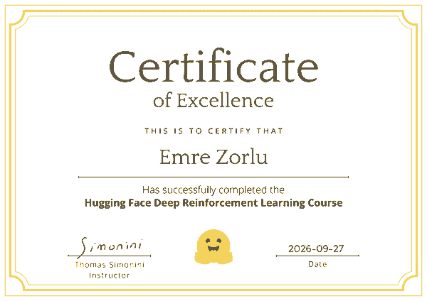

# Hugging Face Deep Reinforcement Learning Course

All 11 hands-on assignments of the [Hugging Face Deep RL Course](https://huggingface.co/learn/deep-rl-course), completed with **11 / 11 passed** and a **Certificate of Excellence** (September 2026).

  

The course goes from tabular Q-learning to deep value-based methods, policy gradients, actor-critic methods, curiosity-driven exploration, multi-agent self-play and a from-scratch PPO implementation. Every trained agent is published on the Hugging Face Hub with its evaluation score and a replay video.

## Results

Score = `mean_reward − std_reward` over the evaluation episodes, as computed by the official certification checker. Units with a threshold of −100 only require a pushed model.

| Unit | Environment | Algorithm | Mean ± Std | Score | Threshold | Model |
|---|---|---|---|---|---|---|
| 1 | LunarLander-v2 | PPO (Stable-Baselines3) | 259.90 ± 20.59 | **239.31** | 200 | [ppo-LunarLander-v2](https://huggingface.co/Zorlu5454/ppo-LunarLander-v2) |
| 2 | Taxi-v3 | Q-Learning (NumPy) | 7.50 ± 2.73 | **4.77** | 4 | [q-Taxi-v3](https://huggingface.co/Zorlu5454/q-Taxi-v3) |
| 3 | SpaceInvadersNoFrameskip-v4 | DQN (Stable-Baselines3) | 699.50 ± 292.60 | **406.90** | 200 | [dqn-SpaceInvadersNoFrameskip-v4](https://huggingface.co/Zorlu5454/dqn-SpaceInvadersNoFrameskip-v4) |
| 4 | CartPole-v1 | REINFORCE (PyTorch, from scratch) | 500.00 ± 0.00 | **500.00** | 350 | [Reinforce-CartPole-v1](https://huggingface.co/Zorlu5454/Reinforce-CartPole-v1) |
| 4 | Pixelcopter-PLE-v0 | REINFORCE (PyTorch, from scratch) | 23.50 ± 12.45 | **11.05** | 5 | [Reinforce-Pixelcopter-PLE-v0](https://huggingface.co/Zorlu5454/Reinforce-Pixelcopter-PLE-v0) |
| 5 | ML-Agents SnowballTarget | PPO (Unity ML-Agents) | pushed | ✓ | −100 | [ppo-SnowballTarget](https://huggingface.co/Zorlu5454/ppo-SnowballTarget) |
| 5 | ML-Agents Pyramids | PPO + RND curiosity | pushed | ✓ | −100 | [ppo-Pyramids](https://huggingface.co/Zorlu5454/ppo-Pyramids) |
| 6 | PandaReachDense-v3 | A2C (Stable-Baselines3) | −0.20 ± 0.09 | **−0.29** | −3.5 | [a2c-PandaReachDense-v3](https://huggingface.co/Zorlu5454/a2c-PandaReachDense-v3) |
| 7 | ML-Agents SoccerTwos | MA-POCA + self-play | pushed | ✓ | −100 | [poca-SoccerTwos](https://huggingface.co/Zorlu5454/poca-SoccerTwos) |
| 8.1 | LunarLander-v2 | PPO from scratch (CleanRL style) | 110.16 ± 88.62 | **21.54** | −500 | [ppo-scratch-LunarLander-v2](https://huggingface.co/Zorlu5454/ppo-scratch-LunarLander-v2) |
| 8.2 | ViZDoom Health Gathering Supreme | APPO (Sample Factory) | 10.34 ± 1.45 | **8.89** | 5 | [rl_course_vizdoom_doom_health_gathering_supreme](https://huggingface.co/Zorlu5454/rl_course_vizdoom_doom_health_gathering_supreme) |

## Notebooks

| Notebook | What it covers | Runtime |
|---|---|---|
| [`unit1_lunarlander_ppo`](notebooks/unit1_lunarlander_ppo.ipynb) | Gymnasium basics, PPO with Stable-Baselines3, evaluation, pushing to the Hub | Colab CPU, ~25 min |
| [`unit2_taxi_q_learning`](notebooks/unit2_taxi_q_learning.ipynb) | Q-table, ε-greedy exploration, the Q-learning update rule | Colab CPU, ~5 min |
| [`unit3_space_invaders_dqn`](notebooks/unit3_space_invaders_dqn.ipynb) | Atari preprocessing, frame stacking, experience replay, target network; resumable training with Google Drive checkpoints | Colab T4 GPU, ~2–3 h |
| [`unit4_cartpole_reinforce`](notebooks/unit4_cartpole_reinforce.ipynb) | Policy network, returns, the REINFORCE loss, best-checkpoint tracking | Colab CPU, ~10 min |
| [`unit4_pixelcopter_reinforce`](notebooks/unit4_pixelcopter_reinforce.ipynb) | REINFORCE on a harder game; custom Gymnasium wrapper for PLE Pixelcopter | Colab CPU, 30–90 min |
| [`unit5_snowballtarget_mlagents`](notebooks/unit5_snowballtarget_mlagents.ipynb) | Unity ML-Agents, PPO training configs | Colab CPU, ~30 min |
| [`unit5_pyramids_mlagents_rnd`](notebooks/unit5_pyramids_mlagents_rnd.ipynb) | Sparse rewards and curiosity (Random Network Distillation) | Colab CPU, ~60 min |
| [`unit6_panda_reach_a2c`](notebooks/unit6_panda_reach_a2c.ipynb) | Actor-critic, advantage, continuous actions, dict observations, `VecNormalize` | Colab CPU, ~30 min |
| [`unit7_soccertwos_poca_local`](notebooks/unit7_soccertwos_poca_local.ipynb) | Multi-agent RL, centralised critic (MA-POCA), self-play and ELO | Local (Windows, CPU), 5–8 h |
| [`unit8_part1_ppo_from_scratch`](notebooks/unit8_part1_ppo_from_scratch.ipynb) | PPO implemented line by line: rollouts, GAE, clipped surrogate objective, value loss, entropy bonus | Colab CPU, ~25 min |
| [`unit8_part2_doom_sample_factory`](notebooks/unit8_part2_doom_sample_factory.ipynb) | Asynchronous PPO on pixel input with Sample Factory | Colab T4 GPU, ~60 min |

### Running the notebooks
- Open a notebook in [Google Colab](https://colab.research.google.com) (`File → Upload notebook`).
- Add a Hugging Face access token with **Write** permission as a Colab secret named **`HF_TOKEN`** (🔑 icon in the left sidebar) and allow the notebook to access it. The login cell reads this secret, so the token never appears in the code.
- Set `HF_USERNAME` in the settings cell to your own username.
- Units 3 and 8.2 need a GPU runtime (`Runtime → Change runtime type → T4 GPU`).

## Engineering notes

Running the course material in 2026 required fixing several breakages caused by library drift. These fixes are built into the notebooks:

| Problem | Symptom | Fix |
|---|---|---|
| `LunarLander-v2` removed from Gymnasium 1.x | `gym.make("LunarLander-v2")` fails (only `-v3` exists), but the certification checker searches for the `LunarLander-v2` tag | Pin `gymnasium==0.29.1` |
| Box2D build fails with the pip `swig` shim | `box2d-py` wheel build error | Install the system `swig` via `apt` |
| NumPy `int64` values in hyperparameter dicts | `TypeError: Object of type int64 is not JSON serializable` when writing the model card | Cast to built-in types before `json.dump` |
| `gym_pygame` depends on the legacy `gym` package | Pixelcopter environment cannot be installed on current Colab | Small Gymnasium wrapper around PLE with the same observations and rewards |
| ML-Agents requires Python 3.10, Colab ships a newer Python | Installation fails | Separate Python 3.10.12 virtual environment created with `uv` |
| Recent PyTorch changed `torch.onnx.export` | `ModuleNotFoundError: onnxscript` — ML-Agents training crashes at the first checkpoint | Pin `torch==2.2.2` (CPU build) in the ML-Agents environment; resume training with `--resume` |
| `setuptools ≥ 81` removed `pkg_resources` | TensorBoard and ML-Agents fail to import | Pin `setuptools<81` |
| PyTorch ≥ 2.6 loads checkpoints with `weights_only=True` | Sample Factory evaluation cannot load its own checkpoint (`UnpicklingError`) | Set `TORCH_FORCE_NO_WEIGHTS_ONLY_LOAD=1` for the evaluation process |
| `notebook_login()` now uses an OAuth device-code flow that expires | `401 Unauthorized` on `create_repo` in long unattended runs | Log in with the `HF_TOKEN` Colab secret, falling back to the interactive login |
| Free Colab sessions disconnect during long runs | Lost DQN training progress | Checkpoints to Google Drive every 100k steps with automatic resume |
| REINFORCE is high-variance | The final policy is often worse than an earlier one | Periodic evaluation on fixed seeds and best-checkpoint tracking |

## Key concepts

- **Q-learning / DQN** — value-based learning with bootstrapped targets; experience replay and a target network stabilise training with neural networks.
- **Policy gradients (REINFORCE)** — directly increase the log-probability of actions in proportion to the return they led to.
- **Actor-critic (A2C)** — a learned value function (critic) reduces the variance of the policy gradient through the advantage `r + γV(s') − V(s)`.
- **PPO** — limits each policy update with a clipped probability ratio; GAE trades off bias and variance in the advantage estimate.
- **Curiosity (RND)** — an intrinsic reward from prediction error drives exploration when extrinsic rewards are sparse.
- **Multi-agent self-play (MA-POCA)** — a centralised critic for cooperative teammates and a pool of past opponents rated with ELO.

## Acknowledgements

Course content by [Hugging Face](https://huggingface.co/learn/deep-rl-course) (Thomas Simonini et al.). The from-scratch PPO follows the structure of [CleanRL](https://github.com/vwxyzjn/cleanrl)'s `ppo.py`. Environments: Gymnasium, Atari (ALE), PLE, Unity ML-Agents, panda-gym and ViZDoom.
